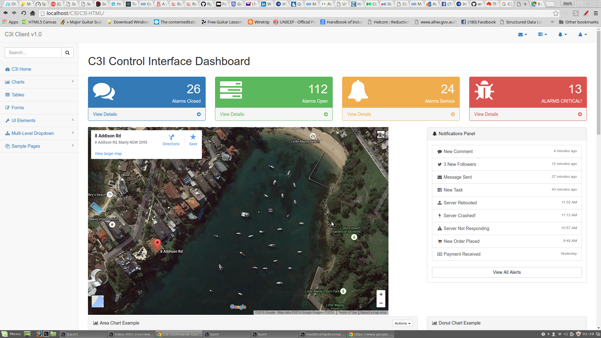

# C3I 
### Mark Addinall - June, 2016
### Brisbane Australia

------
This is an experimental system comprising 
- Asset management, 
- reporting, 
- tracking, 
- machine learning and 
- statistical process control over a distributed network.



Satellie communication systems and tracking have always been an interest of mine.  Some exiting stuff
going on in the world.

This is from Intelligent Aerospace, July 2016.

> ORBCOMM Inc. (Nasdaq:ORBC) is a global provider of Machine-to-Machine (M2M) communication solutions 
> and a commercial satellite network dedicated to M2M. ORBCOMM’s unique combination of global satellite, 
> cellular and dual-mode network connectivity, hardware, web reporting applications, and software is the 
> M2M industry’s most complete service offering. Our solutions are designed to remotely track, monitor, and 
> control fixed and mobile assets in core vertical markets including transportation & distribution, 
> heavy equipment, industrial fixed assets, oil & gas, maritime, mining and government. In addition, 
> ORBCOMM provides Automatic Identification System (AIS) data services for vessel tracking to improve 
> maritime safety to government and commercial customers worldwide.

This is one of several concurrent projects I am working on as part of my 2016 R&D.
Implementing the same application using a number of technology stacks.

- Modern, but still AJAX (AJaJ) RESTful client server systems
- Full stack Javascript systems using Angular2
- Full stack Javascript systems using REact/METEOR
- Full stack Javascript systems using custom components

This is my play on using the latest technologies to provide a flexible, robust and pleasing
UI(X), APIs and RESTFul transaction servers.

- A development stack proposed for C3I that include web sockets, RxJS
, React, jQuery 2.x, AJaJ, Bootstrap.

- I am having a look at this implementation using web-sockets and coding this as
an experiment. 

- I am interested in this technology as a possible inclusion into future
builds of my client software.


I also decided to add the rxJS (Reactive Extensions for Javascript) into this mix so
that more control and versitility can be had in asynchronous data stream processing.

Thinking ahead to 2016 systems (and beyond. 

- Bootstrap UI 		- Responsive UI
- React			- Front end framework
- LESS			- CSS3 pre-processor
- rxJS    		- Reactive Extensions for Javascript
- Rachet		- Web socket implementation for PHP
- MariaDB		- Open source mySQL
- LAMP			- Usual stack
- Bower			- Component management
- Gulp			- Component management
- Composer		- Component management
- Git			- Version control

### Synopsis:

This implementation of C3I is unusual as it is the only implementation where I still
use PHP as the back-end language of choice.  All of y other implementations of this
experiment use Javascript - Full stack.


##  React-Bootstrap UI

*React-Bootstrap* is a library of reusable front-end components. We get the look-and-feel of 
Twitter Bootstrap, but with much cleaner code, via Facebook's React.js framework.

#### A better Bootstrap API using React.js

The Bootstrap code is so repetitive because HTML and CSS do not support the abstractions necessary for a nice library of components. That's why we have to write btnthree times, within an element called button.
The React.js solution is to write directly in Javascript. React takes over the page-rendering entirely. You just give it a tree of Javascript objects, and tell it how state is transmitted between them.

- allows different 'skins' to be versioned per customer
- allows different 'front page' encounters per product
- keeps the HTML and Javascript code of the application intact OVER times the application UI needs to be modified.
- As displayed, allows our application to be used on mobile devices (pods and smart phones) as we provide a screen reactive interface.


## PHP Server

I will continue to use PHP as our server language.  PHP is robust and extensible, and with good engineering skills, it can be lightweight and fast.  I will change my historic model so PHP has nothing to do with the construction of the UI.  This is not the role of PHP in a modern application.  I this newer code set the PHP will provide a SERVER role to ACCEPT API requests and to PROVIDE data as a SERVICE from a timely and robust database conversation.  This server will provide the ONE point of API interaction for AJaJ (AJAX) services.  We will provide JSON rather than XML in this version of the application.


## PHP AJaJ API

This in essence is the contract (or range of requests and services) to be implemented between the abovementioned server, and the requester, the Javascript API.


## Javascript AJaJ API

Whilst providing the contract between the application and the PHP/Database server, this function will provide the application with
a SINGLE point API service for ALL AJaJ requests. We will implement this library in Javascript using some jQuery extensions.
The library will provide an encapsulated C3I namespace, and will present the library as a partially
exported module.

The Module Pattern is what is called a “design pattern”, and it’s extremely useful 
or a number of reasons. The attraction of the Module Pattern (and it’s variant, 
the Revealing Module Pattern, the one we use) are that it makes scoping simple, 
provides a clean way to implement a namespace, and doesn’t overcomplicate JavaScript design.

It also keeps things very simple and easy to read and use, uses Objects in a very 
nice way, and doesn’t bloat your code with repetitive '$this' and prototype declarations.

 
## RxJs

The Reactive Extensions for JavaScript (RxJS) is a set of libraries for composing asynchronous and event-based programs using observable sequences and fluent query operators that are implemented in JavaScript. Using RxJS, developers represent asynchronous data streams with Observables, query asynchronous data streams using our many operators, and parameterize the concurrency in the asynchronous data streams using Schedulers. Simply put, RxJS = Observables + Operators + Schedulers.

Using RxJS, you can represent multiple asynchronous data streams (that come from diverse sources, e.g., stock quote, tweets, computer events, web service requests, etc.), and subscribe to the event stream using the Observer object. The Observable notifies the subscribed Observer instance whenever an event occurs.

Because observable sequences are data streams, you can query them using standard query operators implemented by the Observable type. Thus you can filter, project, aggregate, compose and perform time-based operations on multiple events easily by using these operators. In addition, there are a number of other reactive stream specific operators that allow powerful queries to be written. Cancellation, exceptions, and synchronization are also handled gracefully by using the methods on the Observable object.

Using these extensions in our client/server APIs will greatly enchance the range of asynchronous services we can supply in a robust and timely fashion.  There is a significant learning curve which is reflected in the time proposed to implement.


## Ratchet

Rachet is a set of library objects that allow us to implement Web Sockets into our PHP server development environment.

WebSockets are a bi-directional, full-duplex, persistent connection from a web browser to a server. Once a WebSocket connection is established the connection stays open until the client or server decides to close this connection. With this open connection, the client or server can send a message at any given time to the other. This makes web programming entirely event driven, not (just) user initiated. It is stateful. As well, at this time, a single running server application is aware of all connections, allowing you to communicate with any number of open connections at any given time.

For a system such as ours, Bi-directional communications as opposed to SOAP/REST request/response cycles are of a huge use.  Benefits include:

- Removal of CPU and communications expensive "polling" techniques inside rigid cyclic executive processing loops.
- Ability to receive out of bandwidth and out of order data at the user console via a device 'push - priority' method.
- Firmware testing and upgrades.
- Push application upgrades, unlock codes, new applications etc.

There is a significant learning curve when implementing bi-directional architecture into our web applications.  It is not really new science,
more a re-invention or traditional UNIX socket.io communication as an extra in a HTTP(s) based application.

This is reflected in the time to implement.

Three man weeks.


## Test Suite

As part of the build of all parts of the application, built in test methods such as PHPUnit,
building a test suite comprises the automation of a set odf standard tests that can be run
as an acceptance test suite or as a regression test suite.

To enable this automation it is envisaged that an automated testing tool such as Selenium
be implemented.


##  Deployment Automation

TBA.  Depending upon requirements.

##  Support

TBA.  Depending upon requirements.


# Tool Documentation
------
## RxJS Documentation

[](https://travis-ci.org/Reactive-Extensions/RxJS)
[](https://github.com/Reactive-Extensions/RxJS)
[](https://www.npmjs.com/package/rx)
[](https://www.npmjs.com/package/rx)
[](http://bower.io/search/?q=rxjs)
[](http://www.nuget.org/packages/RxJS-All/)
[](https://gitter.im/Reactive-Extensions/RxJS?utm_source=badge&utm_medium=badge&utm_campaign=pr-badge&utm_content=badge)

**[The Need to go Reactive](#the-need-to-go-reactive)** |
**[About the Reactive Extensions](#about-the-reactive-extensions)** |
**[Batteries Included](#batteries-included)** |
**[Why RxJS?](#why-rxjs)** |
**[Dive In!](#dive-in)** |
**[Resources](#resources)** |
**[Getting Started](#getting-started)** |
**[What about my libraries?](#what-about-my-libraries)** |
**[Compatibility](#compatibility)** |
**[Contributing](#contributing)** |
**[License](#license)**

# The Reactive Extensions for JavaScript (RxJS) <sup>4.0</sup>... #

*...is a set of libraries to compose asynchronous and event-based programs using observable collections and [Array#extras](http://blogs.msdn.com/b/ie/archive/2010/12/13/ecmascript-5-part-2-array-extras.aspx) style composition in JavaScript*

The project is actively developed by [Microsoft](https://microsoft.com/), in collaboration with a community of open source developers.

## The Need to go Reactive ##

Applications, especially on the web have changed over the years from being a simple static page, to DHTML with animations, to the Ajax revolution.  Each time, we're adding more complexity, more data, and asynchronous behavior to our applications.  How do we manage it all?  How do we scale it?  By moving towards "Reactive Architectures" which are event-driven, resilient and responsive.  With the Reactive Extensions, you have all the tools you need to help build these systems.

## About the Reactive Extensions ##

The Reactive Extensions for JavaScript (RxJS) is a set of libraries for composing asynchronous and event-based programs using observable sequences and fluent query operators that many of you already know by [Array#extras](http://blogs.msdn.com/b/ie/archive/2010/12/13/ecmascript-5-part-2-array-extras.aspx) in JavaScript. Using RxJS, developers represent asynchronous data streams with Observables, query asynchronous data streams using our many operators, and parameterize the concurrency in the asynchronous data streams using Schedulers. Simply put, RxJS = Observables + Operators + Schedulers.

Whether you are authoring a web-based application in JavaScript or a server-side application in Node.js, you have to deal with asynchronous and event-based programming. Although some patterns are emerging such as the Promise pattern, handling exceptions, cancellation, and synchronization is difficult and error-prone.

Using RxJS, you can represent multiple asynchronous data streams (that come from diverse sources, e.g., stock quote, tweets, computer events, web service requests, etc.), and subscribe to the event stream using the Observer object. The Observable notifies the subscribed Observer instance whenever an event occurs.

Because observable sequences are data streams, you can query them using standard query operators implemented by the Observable type. Thus you can filter, project, aggregate, compose and perform time-based operations on multiple events easily by using these operators. In addition, there are a number of other reactive stream specific operators that allow powerful queries to be written. Cancellation, exceptions, and synchronization are also handled gracefully by using the methods on the Observable object.

But the best news of all is that you already know how to program like this.  Take for example the following JavaScript code, where we get some stock data and then manipulate and iterate the results.

```js
/* Get stock data somehow */
const source = getAsyncStockData();

const subscription = source
  .filter(quote => quote.price > 30)
  .map(quote => quote.price)
  .forEach(price => console.log(`Prices higher than $30: ${price}`);
```

Now what if this data were to come as some sort of event, for example a stream, such as a WebSocket? Then we could pretty much write the same query to iterate our data, with very little change.

```js
/* Get stock data somehow */
const source = getAsyncStockData();

const subscription = source
  .filter(quote => quote.price > 30)
  .map(quote => quote.price)
  .subscribe(
    price => console.log(`Prices higher than $30: ${price}`),
    err => console.log(`Something went wrong: ${err.message}`);
  );

/* When we're done */
subscription.dispose();
```

The only difference is that we can handle the errors inline with our subscription.  And when we're no longer interested in receiving the data as it comes streaming in, we call `dispose` on our subscription.  Note the use of `subscribe` instead of `forEach`.  We could also use `forEach` which is an alias for `subscribe` but we highly suggest you use `subscribe`.

## Batteries Included ##

Sure, there are a lot of libraries to get started with RxJS. Confused on where to get started?  Start out with the complete set of operators with [`rx.all.js`](doc/libraries/main/rx.complete.md), then you can reduce it to the number of operators that you really need, and perhaps stick with something as small as [`rx.lite.js`](doc/libraries/lite/rx.lite.md).  If you're an implementor of RxJS, then you can start out with [`rx.core.js`](doc/libraries/core/rx.core.md).

This set of libraries include:

### The complete library:
- [`rx.all.js`](doc/libraries/main/rx.complete.md)

### Main Libraries:
- [`rx.js`](doc/libraries/main/rx.md)
- [`rx.aggregates.js`](doc/libraries/main/rx.aggregates.md)
- [`rx.async.js`](doc/libraries/main/rx.async.md)
- [`rx.binding.js`](doc/libraries/main/rx.binding.md)
- [`rx.coincidence.js`](doc/libraries/main/rx.coincidence.md)
- [`rx.experimental.js`](doc/libraries/main/rx.experimental.md)
- [`rx.joinpatterns.js`](doc/libraries/main/rx.joinpatterns.md)
- [`rx.testing.js`](doc/libraries/main/rx.testing.md)
- [`rx.time.js`](doc/libraries/main/rx.time.md)
- [`rx.virtualtime.js`](doc/libraries/main/rx.virtualtime.md)

### Lite Libraries:
- [`rx.lite.js`](doc/libraries/lite/rx.lite.md)
- [`rx.lite.extras.js`](doc/libraries/lite/rx.lite.extras.md)
- [`rx.lite.aggregates.js`](doc/libraries/lite/rx.lite.aggregates.md)
- [`rx.lite.async.js`](doc/libraries/lite/rx.lite.async.md)
- [`rx.lite.coincidence.js`](doc/libraries/lite/rx.lite.coincidence.md)
- [`rx.lite.experimental.js`](doc/libraries/lite/rx.lite.experimental.md)
- [`rx.lite.joinpatterns.js`](doc/libraries/lite/rx.lite.joinpatterns.md)
- [`rx.lite.testing.js`](doc/libraries/lite/rx.lite.testing.md)
- [`rx.lite.time.js`](doc/libraries/lite/rx.lite.time.md)
- [`rx.lite.virtualtime.js`](doc/libraries/lite/rx.lite.virtualtime.md)

### Core Libraries:
- [`rx.core.js`](doc/libraries/core/rx.core.md)
- [`rx.core.binding.js`](doc/libraries/core/rx.core.binding.md)
- [`rx.core.testing.js`](doc/libraries/core/rx.core.testing.md)

## Why RxJS? ##

One question you may ask yourself is why RxJS?  What about Promises?  Promises are good for solving asynchronous operations such as querying a service with an XMLHttpRequest, where the expected behavior is one value and then completion.  Reactive Extensions for JavaScript unify both the world of Promises, callbacks as well as evented data such as DOM Input, Web Workers, and Web Sockets. Unifying these concepts enables rich composition.

To give you an idea about rich composition, we can create an autocompletion service which takes user input from a text input and then throttles queries a service (to avoid flooding the service with calls for every key stroke).

First, we'll reference the JavaScript files, including jQuery, although RxJS has no dependencies on jQuery...
```html
<script src="https://code.jquery.com/jquery.js"></script>
<script src="rx.lite.js"></script>
```
Next, we'll get the user input from an input, listening to the keyup event by using the `Rx.Observable.fromEvent` method.  This will either use the event binding from [jQuery](http://jquery.com), [Zepto](http://zeptojs.com/), [AngularJS](https://angularjs.org/), [Backbone.js](http://backbonejs.org/) and [Ember.js](http://emberjs.com/) if available, and if not, falls back to the native event binding.  This gives you consistent ways of thinking of events depending on your framework, so there are no surprises.

```js
const $input = $('#input');
const $results = $('#results');

/* Only get the value from each key up */
var keyups = Rx.Observable.fromEvent($input, 'keyup')
  .pluck('target', 'value')
  .filter(text => text.length > 2 );

/* Now debounce the input for 500ms */
var debounced = keyups
  .debounce(500 /* ms */);

/* Now get only distinct values, so we eliminate the arrows and other control characters */
var distinct = debounced
  .distinctUntilChanged();
```

Now, let's query Wikipedia!  In RxJS, we can instantly bind to any [Promises A+](https://github.com/promises-aplus/promises-spec) implementation through the `Rx.Observable.fromPromise` method. Or, directly return it and RxJS will wrap it for you.

```js
function searchWikipedia (term) {
  return $.ajax({
    url: 'https://en.wikipedia.org/w/api.php',
    dataType: 'jsonp',
    data: {
      action: 'opensearch',
      format: 'json',
      search: term
    }
  }).promise();
}
```

Once that is created, we can tie together the distinct throttled input and query the service.  In this case, we'll call `flatMapLatest` to get the value and ensure we're not introducing any out of order sequence calls.

```js
var suggestions = distinct
  .flatMapLatest(searchWikipedia);
```

Finally, we call the `subscribe` method on our observable sequence to start pulling data.

```js
suggestions.subscribe(
  data => {
    $results
      .empty()
      .append($.map(data[1], value =>  $('<li>').text(value)))
  },
  error=> {
    $results
      .empty()
      .append($('<li>'))
        .text('Error:' + error);
  });
```

And there you have it!

## Dive In! ##

Please check out:

 - [Our Code of Conduct](https://github.com/Reactive-Extensions/RxJS/tree/master/code-of-conduct.md)
 - [The full documentation](https://github.com/Reactive-Extensions/RxJS/tree/master/doc)
 - [Our many great examples](https://github.com/Reactive-Extensions/RxJS/tree/master/examples)
 - [Our design guidelines](https://github.com/Reactive-Extensions/RxJS/tree/master/doc/designguidelines)
 - [Our contribution guidelines](https://github.com/Reactive-Extensions/RxJS/tree/master/contributing.md)
 - [Our complete Unit Tests](https://github.com/Reactive-Extensions/RxJS/tree/master/tests)
 - [Our recipes](https://github.com/Reactive-Extensions/RxJS/wiki/Recipes)

## Resources

- Contact us
    - [Twitter @ReactiveX](https://twitter.com/ReactiveX)
    - [Gitter.im](https://gitter.im/Reactive-Extensions/RxJS)
    - [StackOverflow rxjs](http://stackoverflow.com/questions/tagged/rxjs)

- Tutorials
    - [The introduction to Reactive Programming you've been missing](https://gist.github.com/staltz/868e7e9bc2a7b8c1f754)
    - [2 minute introduction to Rx](https://medium.com/@andrestaltz/2-minute-introduction-to-rx-24c8ca793877)
    - [Learn RxJS - @jhusain](https://github.com/jhusain/learnrx)
    - [RxJS Koans](https://github.com/Reactive-Extensions/RxJSKoans)
    - [RxJS Workshop from BuildStuff 2014](https://github.com/Reactive-Extensions/BuildStuffWorkshop)
    - [Rx Workshop](http://rxworkshop.codeplex.com/)
    - [Reactive Programming and MVC](http://aaronstacy.com/writings/reactive-programming-and-mvc/)
    - [RxJS lessons - egghead.io](https://egghead.io/technologies/rx)
    - [RxJS Training - @andrestaltz](https://github.com/staltz/rxjs-training)

- Reference Material
    - [Rx Marbles](http://rxmarbles.com/)
    - [RxJS GitBook](http://xgrommx.github.io/rx-book/)
    - [Intro to Rx](http://introtorx.com/)
    - [101 Rx Samples Wiki](http://rxwiki.wikidot.com/101samples)
    - [RxJS Design Guidelines](https://github.com/Reactive-Extensions/RxJS/tree/master/doc/designguidelines)
    - [Visualizing Reactive Streams](http://jaredforsyth.com/2015/03/06/visualizing-reactive-streams-hot-and-cold/)
    - [Your Mouse is a Database](http://queue.acm.org/detail.cfm?id=2169076)

- Essential tools
    - [RxVision](http://jaredforsyth.com/rxvision/)
    - [Percussion](https://github.com/grisendo/Percussion)

- Books
    - [RxJS in Action](https://www.manning.com/books/rxjs-in-action) 
    - [RxJS](http://xgrommx.github.io/rx-book/)
    - [Intro to Rx](http://www.amazon.com/Introduction-to-Rx-ebook/dp/B008GM3YPM/)
    - [Programming Reactive Extensions and LINQ](http://www.amazon.com/Programming-Reactive-Extensions-Jesse-Liberty/dp/1430237473/)
    - [Reactive Programming with RxJS](https://pragprog.com/book/smreactjs/reactive-programming-with-rxjs)

- [Community Examples](examples/community.md)
- [Presentations](examples/presentations.md)
- [Videos and Podcasts](examples/videos.md)

### Install individual packages via [NuGet](http://www.nuget.org/):

    Install-Package RxJS-All
    Install-Package RxJS-Lite
    Install-Package RxJS-Main
    Install-Package RxJS-Aggregates
    Install-Package RxJS-Async
    Install-Package RxJS-BackPressure
    Install-Package RxJS-Binding
    Install-Package RxJS-Coincidence
    Install-Package RxJS-Experimental
    Install-Package RxJS-JoinPatterns
    Install-Package RxJS-Testing
    Install-Package RxJS-Time

### In a Browser:

```html
<!-- Just the core RxJS -->
<script src="rx.js"></script>

<!-- Or all of RxJS minus testing -->
<script src="rx.all.js"></script>

<!-- Or keeping it lite -->
<script src="rx.lite.js"></script>
```

### Along with a number of our extras for RxJS:

```html
<script src="rx.aggregates.js"></script>
<script src="rx.async.js"></script>
<script src="rx.backpressure.js"></script>
<script src="rx.binding.js"></script>
<script src="rx.coincidencejs"></script>
<script src="rx.experimental.js"></script>
<script src="rx.joinpatterns.js"></script>
<script src="rx.time.js"></script>
<script src="rx.virtualtime.js"></script>
<script src="rx.testing.js"></script>
```

### Using RxJS with an AMD loader such as Require.js

```js
require({
  'paths': {
    'rx': 'path/to/rx-lite.js'
  }
},
['rx'], (Rx) => {
  const obs = Rx.Observable.of(42);
  obs.forEach(x => console.log(x));
});
```

## What about my libraries? ##

The Reactive Extensions for JavaScript have no external dependencies on any library, so they'll work well with just about any library.  We provide bridges and support for various libraries including:
- [Node.js](https://www.npmjs.com/package/rx-node)
- [React](http://facebook.github.io/react/)
    - [Rx-React](https://github.com/fdecampredon/rx-react)
    - [RxReact](https://github.com/AlexMost/RxReact)
    - [cycle-react](https://github.com/pH200/cycle-react)
- [Flux](http://facebook.github.io/flux/)
    - [Rx-Flux](https://github.com/fdecampredon/rx-flux)
    - [ReactiveFlux](https://github.com/codesuki/reactive-flux)
    - [Thundercats.js](https://github.com/ThunderCatsJS/thundercats)
    - [Flurx](https://github.com/qwtel/flurx)
    - [RR](https://github.com/winsonwq/RR)
- [Ember](http://emberjs.com/)
    - [RxEmber](https://github.com/blesh/RxEmber)
- [AngularJS](https://github.com/Reactive-Extensions/rx.angular.js)
- [HTML DOM](https://github.com/Reactive-Extensions/RxJS-DOM)
- [jQuery (1.4+)](https://github.com/Reactive-Extensions/RxJS-jQuery)
- [MooTools](https://github.com/Reactive-Extensions/RxJS-MooTools)
- [Dojo 1.7+](https://github.com/Reactive-Extensions/RxJS-Dojo)
- [ExtJS](https://github.com/Reactive-Extensions/RxJS-ExtJS)

## Compatibility ##

RxJS has been thoroughly tested against all major browsers and supports IE6+, Chrome 4+, FireFox 1+, and Node.js v0.4+.

## Contributing ##

There are lots of ways to contribute to the project, and we appreciate our [contributors](https://github.com/Reactive-Extensions/RxJS/wiki/Contributors).  If you wish to contribute, check out our [style guide]((https://github.com/Reactive-Extensions/RxJS/tree/master/doc/contributing)).

You can contribute by reviewing and sending feedback on code checkins, suggesting and trying out new features as they are implemented, submit bugs and help us verify fixes as they are checked in, as well as submit code fixes or code contributions of your own. Note that all code submissions will be rigorously reviewed and tested by the Rx Team, and only those that meet an extremely high bar for both quality and design/roadmap appropriateness will be merged into the source.

First-time contributors must sign a [Contribution License Agreement](https://cla.microsoft.com/).  If your Pull Request has the label [cla-required](https://github.com/Reactive-Extensions/RxJS/labels/cla-required), this is an indication that you haven't yet signed such an agreement.

## License ##

Copyright (c) Microsoft Open Technologies, Inc.  All rights reserved.
Microsoft Open Technologies would like to thank its contributors, a list
of whom are at https://github.com/Reactive-Extensions/RxJS/wiki/Contributors.

Licensed under the Apache License, Version 2.0 (the "License"); you
may not use this file except in compliance with the License. You may
obtain a copy of the License at

http://www.apache.org/licenses/LICENSE-2.0

Unless required by applicable law or agreed to in writing, software
distributed under the License is distributed on an "AS IS" BASIS,
WITHOUT WARRANTIES OR CONDITIONS OF ANY KIND, either express or
implied. See the License for the specific language governing permissions
and limitations under the License.


# Selenium

### Using Selenium with PHPUnit


Testing is a really wide subject, whether it be unit testing, functional testing, acceptance testing, etc. In this article, we’re going to see how you can do acceptance testing using Selenium. I will use a practical example to illustrate a real use case. I will assume that you already know how to do unit testing using PHPUnit, or that you at least have a grasp of what it’s all about. Let’s get started.


### What Is Acceptance Testing?
Acceptance testing is the process of telling user stories through tests, and I love this quote to describe it:

A formal test conducted to determine whether or not a system satisfies its acceptance criteria and to enable the customer to determine whether or not to accept the system.


### What Is Selenium?
Selenium is a tool to automate user interface testing. It helps with testing your application against the browser. The process could be described like so:

- Go to the page http://myapp.dev/videos.
- Assert the page contains a list of 20 videos.
- Click number two on the pagination.
- Assert the page contains a list of 20 videos.
- Quit the browser.

You may be wondering: “How does it manipulate the web page using the described tests?”

The answer is “it depends”. If you’re using Selenium RC (previously named Selenium 1), it will inject auto generated JavaScript code to the page to perform the desired actions. Selenium RC is deprecated and is only supported in maintenance mode; you should be using Selenium WebDriver.

When using Selenium WebDriver (Selenium 2), the tests are translated into commands and passed to the Selenium server (more about that in a moment), then passed to the browser using the web browser native API.

### Application Setup


Because we don’t actually have an application to test, I’m going to use a user registration page. The user will enter his personal information and some billing info. If everything is good, the page should output Everything is Good!. Otherwise, the page will show the subscription form with a list of validation error messages.


We will start testing our application using PHPUnit with the Selenium extension. Be sure to install them using Composer before starting.

composer require --dev phpunit/phpunit
composer require --dev phpunit/phpunit-selenium
We said before that commands are passed to a Selenium server, which then forwards them to the browser. We need to download the Selenium server, which is just a JAVA archive executable. The server can be run using java -jar selenium-server-standalone-<version>.jar. Since we will be using it frequently, it’s a good idea to move it to a bin directory and make an alias for that inside our .bashrc or .zshrc.

alias sserve="java -jar /usr/local/bin/selenium-server-standalone-<version>.jar"
PHPUnit and Selenium
PHPUnit supports both Selenium RC and WebDriver, and it provides two classes for that purpose. The PHPUnit_Extensions_SeleniumTestCase is used for the RC version, and the PHPUnit_Extensions_Selenium2TestCase is used for the WebDriver version. So, your test must extend one of them to get started. Please remember that the RC version is being deprecated, so we’ll use the WebDriver one in our example below.
```
// tests/acceptance/UserSubscriptionTest.php

class UserSubscriptionTest extends PHPUnit_Extensions_Selenium2TestCase
{
    public function setUp()
    {
        $this->setHost('localhost');
        $this->setPort(4444);
        $this->setBrowserUrl('http://vaprobash.dev');
        $this->setBrowser('firefox');
    }
}
```

The setUp method is used for preparing the test environment. In this case, we use it to tell PHPUnit where our Selenium server is running, what browser we’ll be using and the URL of our application. The setHost method defaults to localhost and the setPort method defaults to 4444, so they can be omitted here. However, this can be used if your testing server is inside a Windows machine that supports Internet Explorer while you run your tests from another different machine, etc.

The tearDown method is called when the tests are done, and it’s used to clear the stage. We use it to close the browser and terminate the current session.

public function tearDown()
{
    $this->stop();
}
Data Providers
PHPUnit data providers allow us to feed our tests with specific data without having to iterate over it. You can read more in the documentation.

This allows us to keep a set of well know test(s) suite to be executed on the delivery of code from test to staging as part of the internal acceptance procedure.  It can be used as acceptance testing with the external cusomer as the application leave staging into a live environment.

# Ratchet
### WebSockets for PHP

Ratchet is a loosely coupled PHP library providing developers with tools to create real time, bi-directional applications between clients and servers over WebSockets. This is not your Grandfather's Internet.

## WampServer (Pub/Sub & RPC)
### Purpose of this Component

The WAMP (WebSocket Application Messaging Protocol) specification gives developers (that's you!) a more structured and easy way for your client (JavaScript) and server (Ratchet-PHP) to interact. WAMP provides the RPC and PubSub patterns. WAMP specifies URIs for endpoint handles and JSON for payload transmissions. It is recommended taking a quick read over the WAMP Specification to get an understanding of how and why to use it.

If you choose to build your application on the WAMP spec (highly recommended) you will need a JavaScript library to implement the client side. AutobahnJS is a client to interact with WAMP servers and is highly recommended to use with Ratchet. Using AutobahnJS has a requirement of a deferred library. They recommend using when or jQuery's deferred library. The programming reference for AutobahnJS can be found on Autobahn website.

Note: Although the documentation specified to use URI's as Topic context, there is no enforcement on client or server; you can use any string to identify these topics.

Topics
The WampServer componenet provides a new class that is passed to your application: the Topic class. This is a container that stores all of the Connections who have subscribed to that topic. It also features some useful methods such as broadcast to send a message to every one of its subscribers.

When calling Connection methods that require "string $topic" you can pass the Topic class or it's id.

If you are familiar with other forms of messaging, topics are equivalent to channels.

# Bootstrap

### Bootstrap is the most popular HTML, CSS, and JS framework for developing responsive, mobile first projects on the web.

## One framework, every device.

Bootstrap easily and efficiently scales your websites and applications with a single code base, from phones to tablets to desktops with CSS media queries.
